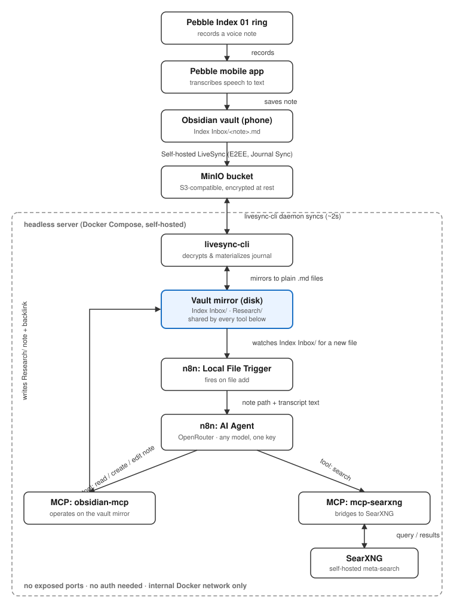

# Pebble Index Research Agent

Turn a voice note captured on your [Core Devices Pebble Index 01](https://repebble.com/index) ring into an
auto-researched, auto-tagged note in your Obsidian vault — no manual copy/paste required.

> **Status: fully validated end-to-end on a real deployment, including a real ring recording** —
> trigger, agent, web research, and sync-back all confirmed working (see [Project Status](#project-status)).

**→ [`docs/SETUP.md`](docs/SETUP.md) has the full step-by-step deployment guide.** This README covers
the *what* and *why*; `docs/SETUP.md` is what you actually follow to deploy it yourself.

## Contents

- [How it works](#how-it-works)
- [Why this design](#why-this-design)
- [Components](#components)
- [Project status](#project-status)
- [Documentation](#documentation)
- [Prerequisites](#prerequisites)
- [License](#license)

## How it works

  

New notes flow back through the same MinIO sync path to your phone/desktop
automatically — no device needs to be online at the same time as any other (see
<a href="docs/TROUBLESHOOTING.md#livesync-cli--vault-mirror-spike-livesync-s3">TROUBLESHOOTING.md</a>
for why).

> The "ring-notes subfolder" name and n8n's Docker network name are specific to *this* project's own
> deployment (`Index Inbox/` and `n8n_n8n_internal`, respectively) — yours will likely be named
> differently. `docs/SETUP.md` shows how to find/set your own for both.

Every research note gets a clear title, 2-5 topical tags, and two fixed tags applied to every note this
workflow creates — `#interests` and `#questions` — plus a `source` link back to the original voice note.
Customizable (see [Reconfiguring things later](docs/SETUP.md#reconfiguring-things-later)).

## Why this design

- **No Docker Desktop needed** — everything runs on a headless Ubuntu server via plain `docker-ce` +
  the `compose` plugin.
- **No Obsidian REST API / no running the Obsidian Electron app on the server** — the vault is mirrored
  to plain Markdown files on disk using [`livesync-cli`](https://github.com/vrtmrz/obsidian-livesync/tree/main/src/apps/cli),
  the official headless companion to the *Self-hosted LiveSync* plugin.
- **Fully self-hostable research** — web search goes through a self-hosted [SearXNG](https://github.com/searxng/searxng)
  instance via an MCP server, so no third-party search API key is required.
- **Standard n8n building blocks** — trigger, AI Agent node, and MCP Client Tool nodes; no custom code
  needed inside n8n itself.
- **No exposed attack surface** — every MCP/service endpoint is internal-only (Docker network isolation,
  no published host ports); secrets never touch git (`docker/.env` and the generated SearXNG secret are
  gitignored — `docker/.env.example` documents what's needed instead).
- **Pull instead of build, if you want** — `mcp-obsidian` and `mcp-searxng` (the two images this project
  actually builds) are published to GHCR on every change; `docker compose pull` skips building them from
  source. Both read their runtime config (port, vault name/mount) from plain environment variables — see
  [Reconfiguring things later](docs/SETUP.md#reconfiguring-things-later).

## Components

| Component | Project | Role |
|---|---|---|
| Vault mirror | [`vrtmrz/obsidian-livesync`](https://github.com/vrtmrz/obsidian-livesync) (`src/apps/cli`) | Headless daemon that keeps a plain-Markdown mirror of the vault in sync with the same MinIO/S3 (or CouchDB) remote used by the Self-hosted LiveSync plugin |
| Object storage | [MinIO](https://min.io/) | S3-compatible remote for Self-hosted LiveSync (assumed already running) |
| Orchestration | [n8n](https://n8n.io/) | Local File Trigger + AI Agent workflow (assumed already running) |
| Obsidian tools | [`StevenStavrakis/obsidian-mcp`](https://github.com/StevenStavrakis/obsidian-mcp) | MCP server for reading/writing/tagging notes directly on disk |
| Web research | [`SecretiveShell/MCP-searxng`](https://github.com/SecretiveShell/MCP-searxng) + [SearXNG](https://github.com/searxng/searxng) | MCP server exposing web search backed by a self-hosted meta search engine |
| stdio→HTTP bridge | [`sparfenyuk/mcp-proxy`](https://github.com/sparfenyuk/mcp-proxy) | Exposes the (stdio) MCP servers above as SSE endpoints n8n can call |

## Project status

Fully validated end-to-end on a real deployment — every piece of the pipeline above, including a real
ring recording — with no known open issues. See [`docs/ARCHITECTURE.md`](docs/ARCHITECTURE.md#open-questions--spikes)
for the detailed validation history if you want the evidence behind that claim.

## Documentation

| Doc | What's in it |
|---|---|
| [`docs/SETUP.md`](docs/SETUP.md) | Step-by-step deployment guide (Phase 0-5), plus [Reconfiguring things later](docs/SETUP.md#reconfiguring-things-later) for changes after your first deploy (rotating credentials, switching models, moving paths, updating the repo, etc.) |
| [`docs/ARCHITECTURE.md`](docs/ARCHITECTURE.md) | The *why* behind every design decision, and the full validation history for each component |
| [`docs/TROUBLESHOOTING.md`](docs/TROUBLESHOOTING.md) | Real errors hit while building this, with exact messages and fixes — check here first if something breaks |

## Prerequisites

- A Core Devices Pebble Index 01 ring + the [Pebble mobile app](https://github.com/coredevices/mobileapp)
- An Obsidian vault using the [Self-hosted LiveSync](https://github.com/vrtmrz/obsidian-livesync) plugin,
  synced through your own MinIO (or other S3-compatible / CouchDB) instance
- A headless Linux server with Docker Engine + the Compose plugin (no Docker Desktop)
- An existing n8n instance (self-hosted) with access to that server
- An [OpenRouter](https://openrouter.ai/) API key — one key, free choice of underlying model

## License

[GNU AGPLv3](LICENSE) — chosen specifically because this is self-hosted software: AGPL's network-use
clause means anyone who runs a modified version of this project as a service for others must also make
their modified source available, closing the "SaaS loophole" that plain GPL leaves open.

---

  

Licensed under <a href="LICENSE">GNU AGPLv3</a>.

